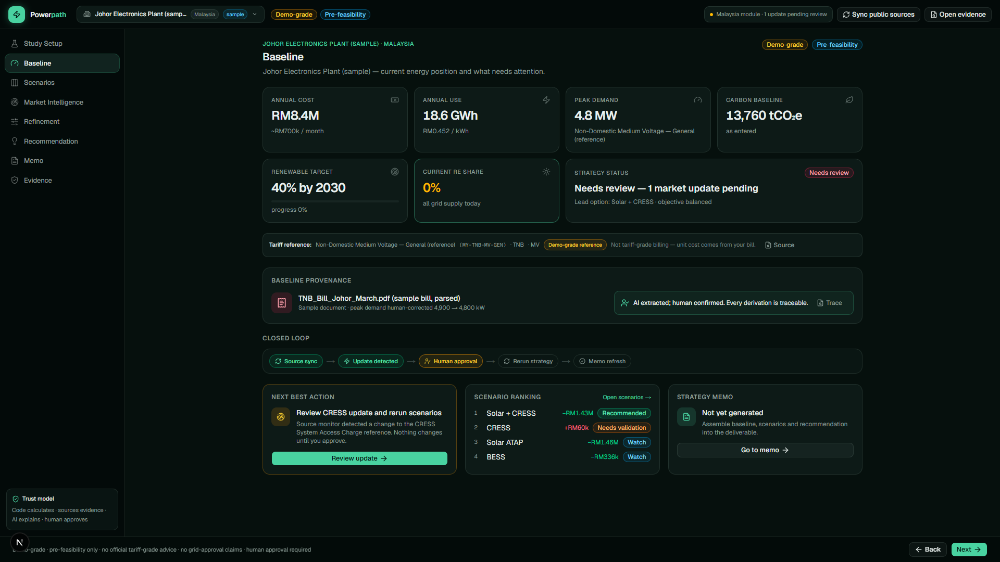
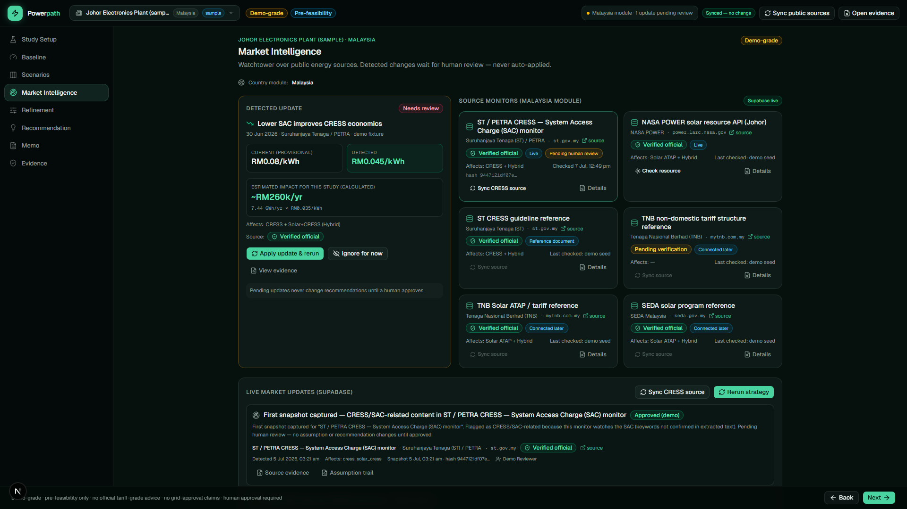
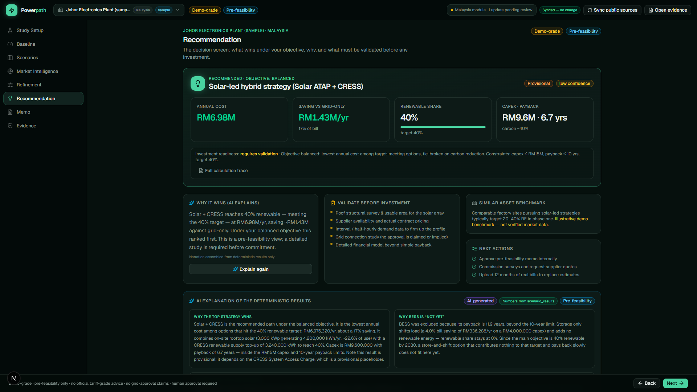

# ⚡ PowerPath

**The AI that runs your company's electricity decisions.**

PowerPath reads a company's energy documents, watches the market around the
clock, and recommends what to do — with numbers a board can trust. Built for
Southeast Asia's large electricity users, starting with Malaysia.

> **The thesis:** energy markets change faster than organisations update their
> decisions. A consulting study ends — PowerPath keeps going:
> analyse → recommend → **monitor → update → re-model → human approves** — always current.

**🎬 Demo video:** [full walkthrough (1:47)](docs/media/PowerPath_Demo_Full.mp4) ·
[90-second cut](docs/media/PowerPath_Demo_90s.mp4) — narrated by Volt, our mascot ⚡

**📄 Hackathon summary:** [docs/MAIC_PROJECT_SUMMARY.md](docs/MAIC_PROJECT_SUMMARY.md)

---

## The trust architecture (why this isn't a chatbot)

Five AI agents run the workflow — but **the AI is architecturally unable to
invent a number**:

| Role | Who | Rule |
|---|---|---|
| **Calculate** | Deterministic engine (`src/lib/energy/`) | Same inputs, same outputs — a calculation trace on every figure |
| **Evidence** | Verified source registry | Official documents fetched live, SHA-256 fingerprinted, immutable snapshots |
| **Explain** | AI agents (Anthropic Claude) | Narrates only — a code-side audit rejects any figure not in engine output |
| **Approve** | A human | Versioned assumptions, recorded reviews, full audit log — **no silent updates, ever** |

The five agents: **Ingest** reads documents · **Watchtower** monitors official
sources 24/7 · **Strategy** generates and stress-tests five energy strategies ·
**Analyst** explains every number · **Memo** drafts the board-ready deliverable.

## The closed loop (the demo's magic moment)

1. **Watchtower** fetches the regulator's actual document and detects a change
   via fingerprint — e.g. a grid access charge cut.
2. The engine **quantifies the impact** for this exact site (~RM260k/yr on the
   sample case).
3. **Nothing moves** until a human clicks *Apply update & rerun* — the approval
   is recorded (who, when, what).
4. The engine **reruns every strategy** on a new assumption version, the
   recommendation re-ranks, and the memo **redrafts itself** — watermarked
   *pending review* until someone signs.

| Baseline | Market Intelligence | Recommendation |
|---|---|---|
|  |  |  |

## Sample case

A representative **Johor electronics plant** (illustrative, not a client):
RM8.4M/yr electricity spend · 18.6 GWh/yr · 4.8 MW peak demand · 40% renewable
target by 2030. All figures are demo-grade, pre-feasibility only — no official
tariff advice, no grid-approval claims. Every number shown traces to either the
sample baseline or a versioned assumption with a source ID.

## Run it locally

```bash
npm install
cp .env.example .env.local   # fill in Supabase + Anthropic keys
npm run dev                  # → http://localhost:3000
```

Database: create a Supabase project, run `supabase/schema.sql` (plus the
migrations in `supabase/`) in the SQL editor, then seed the source registry
with `scripts/seed-source-registry.mts`. Full steps in
[docs/SUPABASE_SETUP.md](docs/SUPABASE_SETUP.md).

Click **Load sample: Johor Electronics Plant** and follow the flow:
Baseline → Scenarios → Market Intelligence (sync a real source, approve the
detected update) → Recommendation (AI explanation) → Memo → Export.

## Stack

Next.js (App Router) + TypeScript · Supabase (Postgres, versioned assumptions,
audit logs) · deterministic calculation engine in code · Anthropic Claude
(explanation & drafting only) · NASA POWER API (live site solar data) ·
hash-based source change detection.

Key reading: [docs/TRUST_RULES.md](docs/TRUST_RULES.md) — the non-negotiable
rules · [docs/CALCULATION_MAP.md](docs/CALCULATION_MAP.md) — how every number
is computed.

## Team

- **Kenneth Jong** — energy domain. Guidehouse Energy & Infrastructure
  consultant: tariffs, grid charges, storage, industrial strategy.
- **Clement Jong** — AI engineering. Built the PowerPath MVP end to end:
  agents, engine, closed loop, audit trail.

**Contact:** kennethjong00@gmail.com · clementjong04@gmail.com

---

*Pre-feasibility only. Demo-grade data, honestly labeled. Code calculates ·
sources verify · AI explains · humans approve.*
